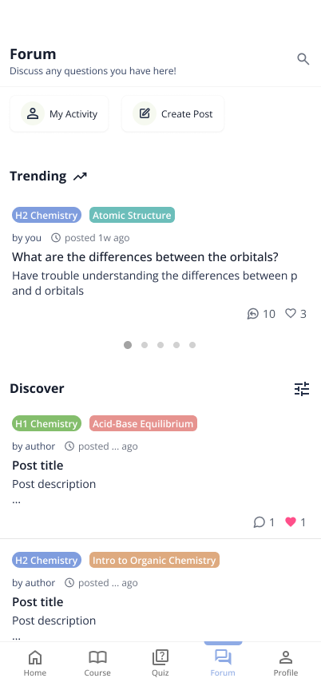
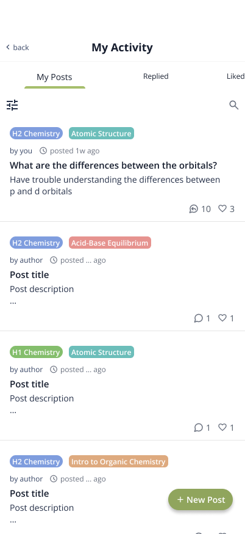
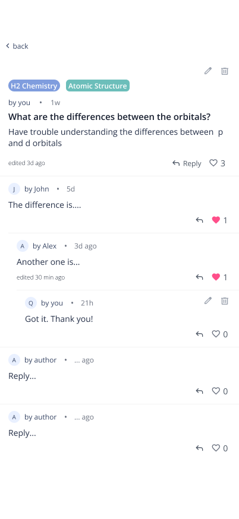
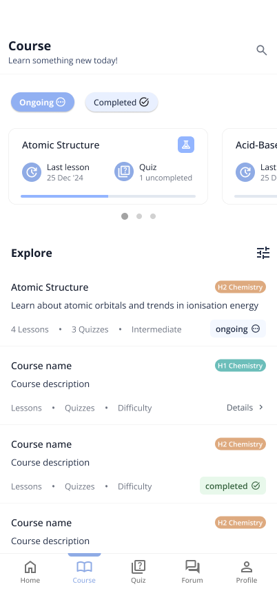
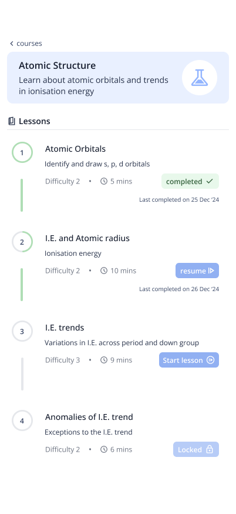

# Atomix

Atomix is an innovative educational platform that transforms learning into an engaging and collaborative journey. Featuring interactive forums for meaningful discussions, well-structured courses, and dynamic quizzes, Atomix inspires students to connect, share knowledge, and unlock their full potential.

## Table of Contents

- [Features](#features)
  - [Forum](#1-star2-forum)
  - [Courses](#2-books-courses)
  - [Quizzes](#3-dart-quizzes)
  - [Progress Tracking](#4-bar_chart-progress-tracking)
- [Tech Stack](#tech-stack)
- [Project Roadmap](#project-roadmap)
- [Design Overview](#design-overview)
- [Contributors](#contributors)

## Features

### 1. :star2: Forum

- Engage in meaningful discussions and share insights with peers.
- Create new posts or reply to existing ones to discuss questions or share insights.
- Posts are categorized by topics and level for easier discovery.
- **My Activity** section organises all the posts you created, replied and liked.

|  |  |  |
| ----------------------------------------- | ------------------------------------------------------------ | ------------------------------------------- |
| Forum tab                                 | My Activity                                                  | Post details                                |

### 2. :books: Courses

- Explore a variety of courses designed for effective learning.
- Courses are broken down into lessons with clear learning objectives.
- Track your progress through each course and lesson.
- Engaging lessons designed to enhance learning effectiveness.

|  |  |
| ------------------------------------------- | --------------------------------------------------- |
| Course tab                                  | Course details                                      |

### 3. :dart: Quizzes

- Test your knowledge with interactive quizzes and track your progress.

### 4. :bar_chart: Progress Tracking

- Monitor your learning journey with personalized dashboards.
- View your completed lessons, quizzes, and overall performance.
- Progress is synced across devices, allowing you to continue learning anytime, anywhere.

## Tech Stack

- React Native
- Expo
- Neon PostgreSQL
- Clerk
- Tailwind CSS (NativeWind)

## Project Roadmap

### In Progress

#### Homepage

- Home navigation tab and content

#### Quiz

- Quiz navigation tab and content
- Dedicated quizzes for each course

#### User Profile

- User profile navigation tab and content
- Allow users to upload images for their profiles

#### Forum

- Improve post tagging system to provide support for other subjects and levels

#### Course

- Add course content for various topics

### Future Enhancements

- AI chatbot for students to clarify quetions
- Support for videos in lesson content
- Add support for course content of other subjects

## Design Overview

Explore the comprehensive design assets for this project, including:

- Mockups for Screens: Visual representations of the app's layout and structure.
- UI Designs for Components: Detailed designs for individual elements like buttons, forms, and navigation bars.
- Interactive Prototype: Simulates user journeys and showcases the app's flow and functionality.

[View the Design on Figma](https://www.figma.com/design/KxGzLPcXkkJBJhIxbAgBOC/Atomix?node-id=195-14&t=AeIBEodyyp2sk9PO-1)

## Contributors

[@gladwintan](https://github.com/gladwintan)
